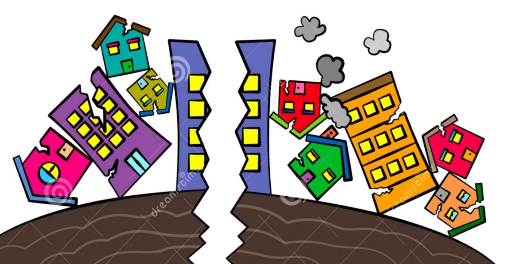
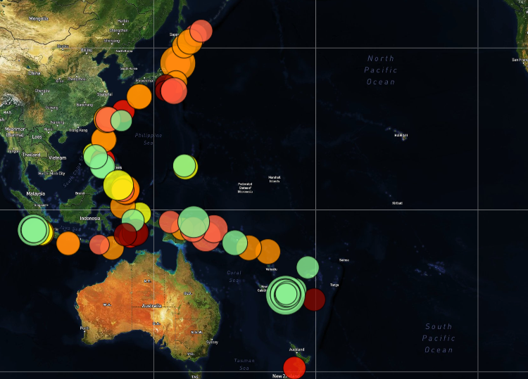

# The Ground Is Shaking!

## Table of contents
* [Assignment](#assignment)
* [Data Sources](#data_sources)
* [Data Visualization](#vis)
* [Evaluation](#eval)
* [References](#ref)

## Assignment
Using an available dataset from the United States Geological Survey (USGS) GeoJSON feed, build a tool to visualize earthquake data.

## Data Sources
The USGS url was provided, where we could choose a datasource for mapping.  An html template was provided, along with a basic CSS Stylesheet.  Other links to D3 JS and Leaflet JS were also included. Original files can be found at the links below: 

* USGS GeoJSON Information Page: https://earthquake.usgs.gov/earthquakes/feed/v1.0/geojson.php 
* USGS Dataset Selected: All Earthquakes Past 7 days: https://earthquake.usgs.gov/earthquakes/feed/v1.0/summary/all_week.geojson 
* html template: https://github.com/KLacerda08/leaflet-challenge/blob/main/Resources/index.html
* css style sheet: https://github.com/KLacerda08/leaflet-challenge/tree/main/Resources/static/css/style.css

## Data Visualization
The index.html file contained the framework to store the data visualization, which was created using the Mapbox API, Leaflet, D3, and USGS data in GeoJSON format. The data series I selected for mapping was for earthquakes over the past 7 days, which is updated every minute. The data visualization was coded in the logic.js
file and included the following general steps:
* Storing the USGS GeoJSON data endpoint in the query URL and performing a GET request using d3.json
* Creating several functions to generate the visualization
* Creating marker colors with size based on magnitude and color based on earthquake depth
* Creating a popup that included additional information about the earthquake (location, datetime, magnitude, and depth) when the marker is clicked
* Selecting map layers (using the mapbox API and Leaflet), which included the lightmap, satellite, and streetmap layers
* Creating basemaps and overlay maps
* Adding a legend

Run the index.html file in live server to visualize the map (in the directory linked below); choose your map type using the radio buttons at the top right!
https://github.com/KLacerda08/leaflet-challenge/tree/main/Leaflet-Step-1

## Evaluation - Are You in a High Risk Earthquake Zone?  

As of the date of this evaluation (2/13/2021), over the past week, most of the earthquakes in the Continental US have been below Magnitude 4 on the Richter Scale, indicating a negligible likelihood of damage (https://www.usgs.gov/media/images/eq-magnitude-energy-release-and-shaking-intensity-6).  Earthquake depths tended to be shallow (less than 10 kilometers (km) deep). A small number in the western US (CA, WA, and NV) reached depths of 30 to 50 km.  

#### Contintental US

In contrast, the depth and frequency of occurrence of earthquakes in Alaska are much greater than in the Contintental US.  Along the Pacific Rim in Central America, South America, Asia and Pacific Island nations, earthquake magnitude and depth tended to be consistently higher. 

#### South Pacific Rim

#### Asia Pacific Rim

A map of the Pacific Rim / Ring of Fire is provided below for context.   

This visualization would be improved with an overlay of tectonic plates around the globe! 

## References
README Images
* https://www.google.com/imgres?imgurl=https%3A%2F%2Fwebstockreview.net%2Fimages%2Fearthquake-clipart-cartoon-2.jpg&imgrefurl=https%3A%2F%2Fwebstockreview.net%2Fexplore%2Fearthquake-clipart-cartoon%2F&tbnid=W_dwTyrOFr4WyM&vet=12ahUKEwjvxcL4_-fuAhWRn-AKHTkhC2kQMyg0egQIARBY..i&docid=HXnZ1_Q_Yq5TPM&w=1183&h=703&q=earthquake%20images%20cartoon&hl=en&client=firefox-b-1-d&ved=2ahUKEwjvxcL4_-fuAhWRn-AKHTkhC2kQMyg0egQIARBY
* https://www.britannica.com/place/Ring-of-Fire

